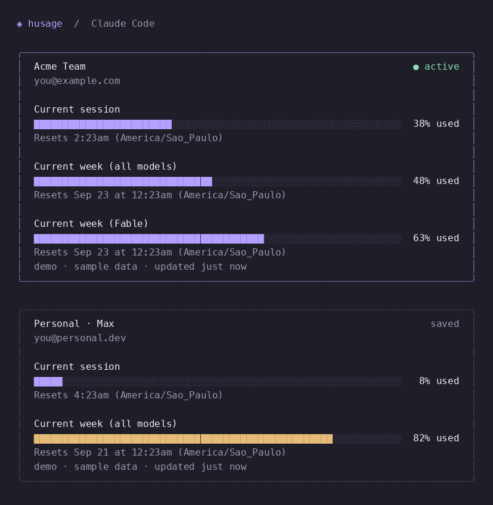

# husage

A quiet, keyboard-driven dashboard for your Claude Code, Codex, and Cursor subscriptions. Built with [Bubble Tea v2](https://github.com/charmbracelet/bubbletea) and Lip Gloss.



## Run

Requires Go 1.25 or newer and a terminal. Install the native Claude, Codex, or Cursor CLI for the subscriptions you want to monitor.

```sh
go run .
```

Or build a standalone binary:

```sh
make build
./bin/husage
```

Try the interface without accessing accounts or the network:

```sh
go run . --demo
```

The dashboard shows account names, email addresses, the active login for each provider, session usage, weekly usage, and model-specific limits when available. Subscriptions are grouped into provider sections with a heading and subscription count. Cards from the same provider appear side by side when space allows, with equal heights within each row. Extra cards wrap to another row; narrow terminals stack the cards vertically. Reset times use your system timezone. Usage bars turn amber at 75% and rose at 90%.

| Key | Action |
| --- | --- |
| `a` | Add a Claude/Codex profile or restore the existing Cursor account (choose the provider first) |
| `c` | Edit configuration |
| `d` | Select and remove a subscription from husage |
| `r` | Refresh data |
| `↑` / `↓`, `k` / `j` | Scroll |
| Page Up / Page Down, Ctrl+B / Ctrl+F | Scroll a page |
| Home / End, `g` / `G` | First / last account |
| `q`, Esc, Ctrl+C | Quit |

## Configuration

The dashboard automatically reloads every **5 minutes** by default. On the first interactive launch, husage creates `~/.config/husage/config.json`:

```json
{
  "refresh_interval": "5m"
}
```

Press **c** to edit the auto-reload interval. Use a duration such as `30s`, `5m`, `10m`, or `1h` (minimum `5s`). **Ctrl+U** clears the field, **Enter** saves and applies the interval immediately, and **Esc** discards edits. The next automatic reload is scheduled from the time you save. Changes persist across restarts; manual edits to the file take effect on the next launch.

`--refresh` overrides the saved interval for that launch without changing the file. Saving from the configuration screen replaces that override and persists the new value. Snapshot modes (`--once` and `--json`) do not create configuration files.

Each profile caches usage for five minutes, even if the dashboard reloads more frequently. Native credential changes can trigger an earlier read.

## Where usage comes from

husage reads the current Claude account from `~/.claude.json`, obtains its existing OAuth login from macOS Keychain or `.credentials.json`, and makes a read-only request to `https://api.anthropic.com/api/oauth/usage`. This is an internal Claude endpoint, so its schema or availability can change. The parser supports both `seven_day_*` buckets and newer `limits[].kind = weekly_scoped` model caps, including Fable.

The live dashboard combines independently authenticated Claude configurations. Each configuration keeps its own credentials, usage cache, and refresh cooldown. Subscriptions sharing an email stay separate when their organization IDs differ. Duplicate configurations of the same subscription produce one card, and a missing or expired login does not hide other accounts. The subscription matching the current shell's Claude configuration appears first with the active badge.

The direct provider requests usage at most once every five minutes per configuration during a run and honors longer `Retry-After` delays. Pressing `r` does not bypass this cooldown. Successful Claude usage reads are saved under `~/.cache/husage/claude/` in private files keyed by account and organization. The cache contains usage windows and their original timestamp, never credentials. Failed requests (including rate limits) display the last successful usage with the error and an explicit **Stale data** warning, including after restarting husage. A successful refresh replaces the cache and clears the warning. With no successful read yet, the card shows the error without usage. Missing or corrupt caches are ignored; cache write failures leave live usage visible with a warning. Data older than ten minutes is marked stale; a past reset is labeled rather than inventing fresh usage. Missing limits and reset times remain unavailable.

Usage polling never switches accounts or runs inference. When a profile's access token expires, husage delegates renewal to the native `claude auth login --claudeai` command using that profile's saved refresh token and scopes. Claude's [documented non-interactive login environment](https://code.claude.com/docs/en/env-vars) avoids opening a browser and lets Claude manage credential persistence. The refresh token is passed only in the child process environment, never in command arguments or terminal output. A usage HTTP 401 triggers at most one renewal and retry; HTTP 403 and rate limits do not trigger renewal. Failed renewals back off for five minutes. macOS may ask for access to the existing Keychain item. Credential storage follows [Claude Code's authentication documentation](https://code.claude.com/docs/en/authentication#credential-management).

If a refresh token has expired or been revoked, or its saved scopes are missing, automatic renewal cannot recover it. The dashboard shows a login command targeting that specific profile. Complete that login, then press **r**; husage detects the new credentials without a restart. Profile creation still asks you to confirm the interactive login command before running it. Concurrent husage renewals for the same credential store are serialized with a short-lived lock under `~/.config/husage/locks/`.

## Add a profile in the TUI

For Claude and Codex, press `a`, choose the provider with **↑ / ↓** and press **Enter**, then enter a profile name (for example, `personal`), and press Enter to preview the login command. Nothing is created or executed yet. Press Enter again to execute it: husage creates `~/.config/husage/claude/personal` or `~/.config/husage/codex/personal` and temporarily hands the terminal to `claude auth login --claudeai` or `codex login`. The command uses the new directory as `CLAUDE_CONFIG_DIR` or `CODEX_HOME`.

Only after the command exits successfully does husage append the directory to `~/.config/husage/profiles.json` and add the profile to the dashboard. A failed or cancelled login returns to the confirmation screen without registering the profile; Enter retries the login. If login succeeds but saving the list fails, Enter retries only the save. The native CLI's files in the prepared directory are retained, including after a failed login, so credentials are never removed as part of error recovery.

Names accept 1–48 letters, numbers, dashes, or underscores and must start with a letter or number. Esc cancels the form; before execution this leaves no files behind. After an unsuccessful attempt, you can reuse the same name even after closing the form or restarting husage: an unregistered directory without credential files or saved account metadata can be reused, preserving its setup files. Registered profiles, directories containing credentials or account metadata, symbolic links, and invalid metadata are rejected when starting a new setup. New profile directories and the JSON file are created with owner-only permissions. The child login process uses its own `CLAUDE_CONFIG_DIR` or `CODEX_HOME` and clears inherited credential overrides, exactly as shown in the preview. The command runs directly without a shell.

Claude and Codex profile creation always saves to the default `~/.config/husage/profiles.json`, including when the current view was launched with `--profiles`, `--claude-dir`, or `--codex-home`. Those overrides continue to control future launches when explicitly supplied. Demo mode stays read-only and does not offer profile creation.

For Cursor, press **a**, choose **Cursor** with **↑ / ↓** and press **Enter**, then press **Enter** to review and **Enter again** to add the existing CLI account. No profile name or new login is required. husage checks that native credentials exist, clears the Cursor disabled marker, and saves a `current` entry in the selected profile list (`--profiles`, if supplied, otherwise the default). The account returns immediately without restarting. If you are signed out, run `cursor-agent login` in another terminal and retry; failed checks or saves leave the list unchanged.

## Remove a subscription

Press **d**, use **↑ / ↓** (or **k / j**) to select a subscription, then press **Enter** to review and **Enter again** to confirm. **Esc** cancels. husage removes every profile currently represented by that card from the dashboard and its saved profile list. For Claude and Codex, named profile directories under `~/.config/husage/claude/` and `~/.config/husage/codex/` are permanently deleted, including credentials and session files. You can then add the same name and log in again. Default native homes, externally supplied directories, Cursor’s shared login, Keychain items, and usage caches are kept. The confirmation screen explains the deletion. Failed saves restore staged directories and keep the subscription visible; directory cleanup failures show an error with the remaining path for retry.

Removal updates `~/.config/husage/profiles.json`, or the list selected with `--profiles`. Explicit `--claude-dir` and `--codex-home` flags can show a removed subscription again on a future launch; omit those flags to use the saved list. A profile supplied only through a flag is removed from the running dashboard without altering unrelated saved entries.

When the last subscription for a provider is removed, husage saves a marker such as `{"provider":"codex","disabled":true}` to prevent automatic discovery on restart. New profiles added with **a** still work. To restore an existing login permanently, add its directory to the profile list (for example, `{"provider":"codex","directory":"current"}`); to resume automatic discovery, remove the marker while keeping the list a nonempty array.

## Show two subscriptions

Keep your existing Claude login, and log into your second subscription in a separate native configuration. Select the other subscription/organization during authentication:

```sh
env -u CLAUDE_SECURESTORAGE_CONFIG_DIR \
  CLAUDE_CONFIG_DIR="$HOME/.claude-secondary" \
  claude auth login --claudeai
```

Then show both in husage:

```sh
./bin/husage --claude-dir current --claude-dir "$HOME/.claude-secondary"
```

`current` follows `CLAUDE_CONFIG_DIR` and `CLAUDE_SECURESTORAGE_CONFIG_DIR` from your shell, falling back to Claude's default login. Every explicit directory uses its own native credential store; it does not inherit the shell's secure-store override. Use the same absolute directory string used for login, because Claude derives its macOS Keychain service name from that string.

To make these profiles the default, create `~/.config/husage/profiles.json`:

```json
["current", "~/.claude-secondary"]
```

After that, just run `./bin/husage`. This file contains provider selections and directory paths only. husage never copies or saves tokens. `--profiles /path/to/profiles.json` selects a different list, and explicit `--claude-dir` arguments override its Claude entries; `--codex-home` overrides its Codex entries. Legacy string entries continue to select Claude profiles. The demo remains entirely offline and includes both providers.

For a secondary login that cannot be renewed automatically, repeat its login command above or open Claude Code with that same `CLAUDE_CONFIG_DIR`, then press **r** in husage.

## Codex subscriptions

Codex accounts are isolated by `CODEX_HOME`, which defaults to `~/.codex`. husage uses the installed CLI's [app-server account interface](https://learn.chatgpt.com/docs/app-server): `account/read` identifies the ChatGPT login and `account/rateLimits/read` returns its usage windows. Codex manages its native credentials and authentication renewal. husage never opens a model thread, generates tokens, or consumes reset credits.

The current Codex home is discovered automatically alongside your Claude profiles. To show multiple existing Codex homes:

```sh
./bin/husage --codex-home current --codex-home "$HOME/.codex-work"
```

To create another login, press **a**, select **Codex** with **↑ / ↓** and **Enter**, and follow the confirmation/login flow. To save homes that already exist, add typed entries to `~/.config/husage/profiles.json`, preserving your existing entries:

```json
[
  "current",
  "~/.claude-secondary",
  {"provider": "codex", "directory": "current"},
  {"provider": "codex", "directory": "~/.codex-work"}
]
```

For Codex entries, `current` resolves `CODEX_HOME` from your shell, falling back to `~/.codex`. A Codex configuration `--profile` is not a separate login home. On the first Codex addition through the TUI, husage also saves a `current` Codex entry to retain the automatically discovered account.

Cards show the home name, ChatGPT plan, account email, usage percentages, and reset times. Windows are labeled using their reported duration; plans that only expose a weekly limit show only that limit. Additional metered buckets appear separately. Distinct account/workspace IDs remain separate even when the email matches. API-key and cloud-provider authentication do not expose ChatGPT subscription usage and show an explanation instead. Missing or failed homes do not hide healthy subscriptions.

Codex polling is bounded to five minutes per home. Changes to file-based `auth.json` are detected on the next reload without reading or displaying token contents; keychain-only login changes are picked up on the next scheduled poll. App-server may update its normal native state/logs and renew credentials while serving these account requests. Its protocol is evolving; the integration was verified with Codex CLI 0.155.0.

## Cursor subscriptions

husage automatically discovers the **existing signed-in Cursor CLI account** and shows it in a Cursor section. If you have not logged into the CLI yet, run:

```sh
cursor-agent login
```

Then launch `./bin/husage` (or press **r** if it is already open). This uses the CLI login, not the Cursor editor's separate credential store. Browser login is described in [Cursor's authentication documentation](https://cursor.com/docs/cli/reference/authentication).

On macOS, husage reads the native `cursor-access-token` Keychain item for `cursor-user`. File credentials use the native `auth.json`: `~/.cursor/` on macOS when `AGENT_CLI_CREDENTIAL_STORE=file`, `$XDG_CONFIG_HOME/cursor/` or `~/.config/cursor/` on Linux, and `%APPDATA%/Cursor/` on Windows. husage does not copy tokens or modify native credentials. Expired logins must be renewed by Cursor CLI; the card explains how to log in again.

The adapter uses the same read-only `GetMe`, `GetCurrentPeriodUsage`, and `GetPlanInfo` RPCs used by Cursor CLI, via `api2.cursor.sh`. These are internal endpoints, verified against Cursor CLI `2026.09.15-d2fe57e`, and may change. No agent session is started, no inference is requested, and no billing setting is changed.

Cards show the team/plan, included usage, Auto and API-model usage when reported, and the billing-cycle reset date. Cursor's reported percentages take precedence over spend/limit calculations because the usage pools may have different allowances. A fixed individual on-demand limit is shown when available. Unknown or unlimited budgets are not invented as percentage bars; plans without percentage-based limits show a message directing you to the Cursor dashboard.

Usage is cached for five minutes, with longer server `Retry-After` delays respected. Successful usage is persisted under `~/.cache/husage/cursor/`, keyed by the verified user/team identity. A failed usage request can show this data with a stale warning. An initial identity request failure after restart cannot use the disk cache until the account is verified. A changed login clears the in-memory cache; signing out clears displayed usage.

Use **d** to remove Cursor from husage while keeping its native login. To restore it, use **a → select Cursor → Enter → Enter → Enter**. You can also add `{"provider":"cursor","directory":"current"}` to your profile list. A `{"provider":"cursor","disabled":true}` marker suppresses automatic discovery until an explicit entry is added or the marker is removed.

The **a** flow restores the current Cursor CLI account. Separate Cursor logins are not supported: `CURSOR_CONFIG_DIR` changes settings but does not isolate native credentials. Claude and Codex keep their existing multiple-profile flows.

## Options

```sh
./bin/husage --once                         # Styled snapshot, then exit
./bin/husage --json                         # Account and usage data; no tokens
./bin/husage --timezone America/Sao_Paulo
./bin/husage --refresh 10s                  # Local polling; minimum 5 seconds
./bin/husage --claude-dir ~/.claude-work     # Select another Claude configuration
./bin/husage --claude-dir current --claude-dir ~/.claude-secondary
./bin/husage --codex-home current --codex-home ~/.codex-work
./bin/husage --profiles /path/to/profiles.json
./bin/husage --demo --once --width 60
```

`CLAUDE_CONFIG_DIR` selects the Claude configuration directory. `CLAUDE_SECURESTORAGE_CONFIG_DIR`, when set, selects its credential store. Custom macOS configuration directories use Claude's hashed Keychain service suffix. API-key and cloud-provider billing are outside this subscription view.

## Development

```sh
make lint
make test
make build
```

GitHub Actions runs these checks on pushes to `main` and on pull requests, using the Go version in `go.mod`. Lint checks formatting with `gofmt` and runs `go vet`. Build and race-enabled tests run on Linux and macOS. The workflow follows [GitHub's Go CI guide](https://docs.github.com/pt/actions/tutorials/build-and-test-code/go).

The `internal/subscription.Provider` interface separates acquisition from rendering. Add another harness by implementing `Load(context.Context)` and returning account names, usage windows, timestamps, and source/error information. The adapters live in `internal/claude`, `internal/codex`, and `internal/cursor`; the Bubble Tea model lives in `internal/tui`.

Tests cover native Claude account discovery, multiple organizations sharing an email, profile lists and overrides, credential isolation, partial failures, duplicate subscriptions, missing and malformed metadata, scoped model limits, refresh cooldowns, rate-limit backoff, terminal widths, scrolling, and timezone conversion. The UI has also been exercised in a real PTY for resize, refresh, scrolling, and clean terminal restoration.
